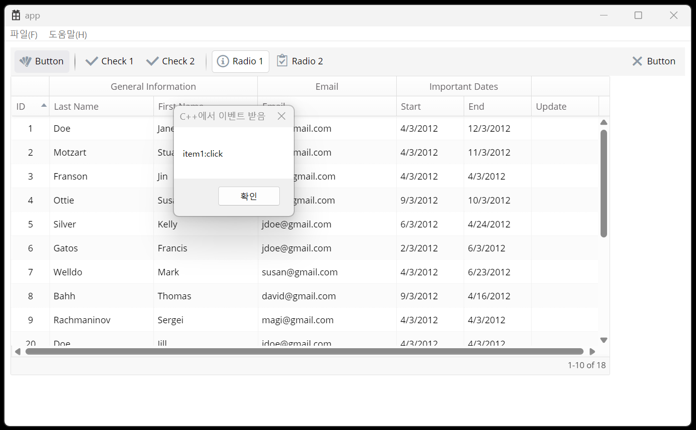

# modern_cpp_window_webui

Microsoft Edge WebView2 control을 이용해서 webui를 winapi환경에서 구현.  

원래 modern cpp 스타일로 간단한 winapi ui 클래스 라이브러리(wui)를 만들다가  
예제로 IWebView2을 사용하는 것을 만들다 보니 여기까지 옴.

  
- .rc에 webpage 파일들 등록.  
- 웹페이지(.js)와 native application(C++)이 json으로 메시지 교환 함.  
- w2ui를 이용하면 꽤 쓸만할 것 같음.  
- 아직 만드는 중...  
- WinUI3는 다시 봐도 마음에 안든다.

## 참고 url
- https://github.com/MicrosoftEdge/WebView2Browser  
- https://w2ui.com/web/  

